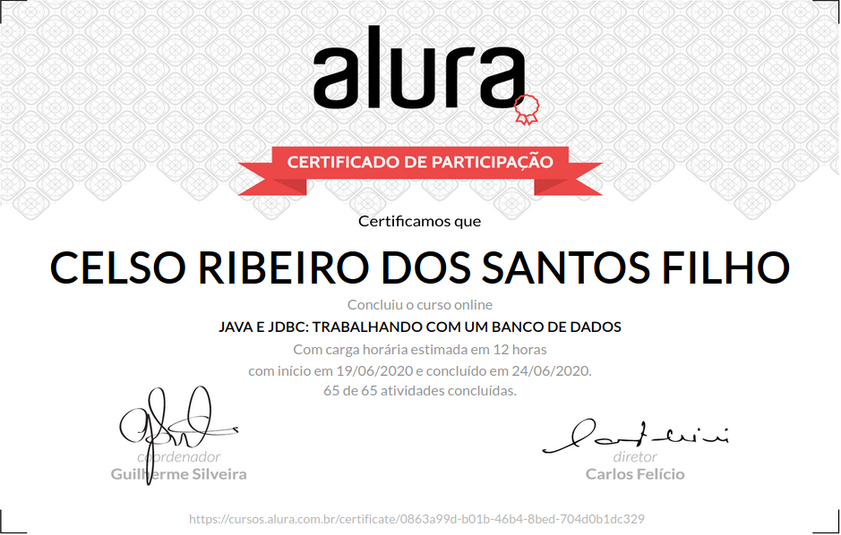

# Formação Java - Alura
+ Programe sistemas Web com Spring MVC, JPA e Java

# Curso 12 - Java e JDBC: Trabalhando com um banco de dados

## O que estou aprendendo neste curso:

+ Estabelecer uma conexão com um banco de dados relacional.

+ Indo além do Statement e do ResultSet.

+ Encapsuleando o acesso em um DAO.

+ Connection pool, datasources e outros recursos importantes.

## Conteúdo das Aulas

+ Introdução ao JDBC e o padrão Factory
                
        Introdução
        Ambiente e versões
        Usando um banco de dados
        API e interfaces
        A primeira conexão
        Exceção ao recuperar a conexão

+ Executando comandos SQL no Java 
  
        Listagem com Statement
        Connection, Statement e ResultSet
        Criando a ConnectionFactory
        Factory Pattern
        Inserindo com Statement
        Retorno do método execute()
        Removendo dados

+ Evitando SQL Injection  
      
        Usando PreparedStatement
        Sobre o PreparedStatement
        Listagem e remoção
        Trocando o Statement
   
+ Controle de transação
        
        O que é pool e datasource?
        Um único cliente
        Criando o pool de conexões
        Diversos clientes
        Testando o pool de conexões
        Pool com conexões ocupadas
        
+ Camada de persistência com DAO

        Criando o modelo Produto
        DAO com inserção do produto
        Vantagens do DAO
        Listando no ProdutoDAO
        DAO's e construtor

+ Evitando queries N + 1 

        Relacionamento entre tabelas
        Vantagens da chave estrangeira
        Modelo e o DAO de categorias
        Queries N + 1
        Por que evitar queries N + 1?
        Usando Inner Join
        Informações relacionadas
        Projeto do curso
        Conclusão

# Certificado de conclusão

<!--  -->