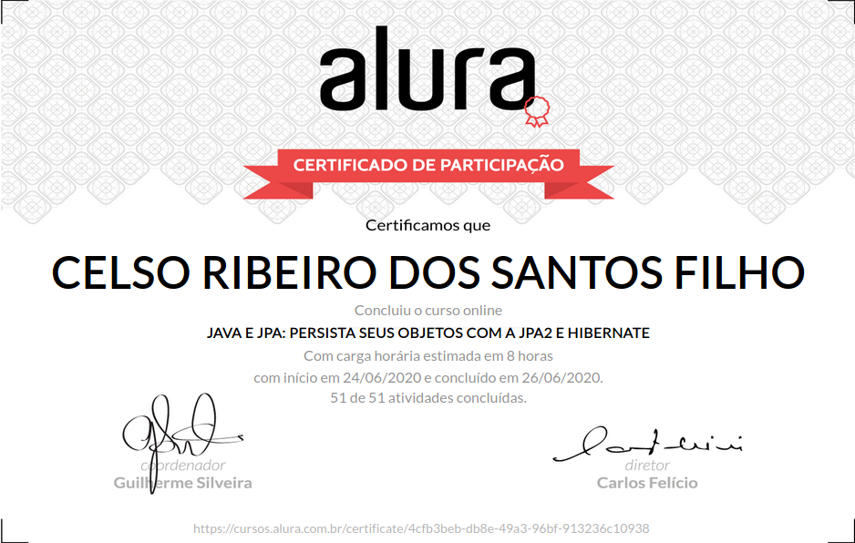

# Formação Java - Alura
+ Programe sistemas Web com Spring MVC, JPA e Java

# Curso 13 - Java e JPA: Persista seus objetos com a JPA2 e Hibernate

## O que estou aprendendo neste curso:

+ Entenda as dificuldades do uso do JDBC puro.

+ Abuse da persistência orientada a objetos.

+ Conheça e aprenda a trabalhar com todos os estados de uma entidade.

+ Fique fera em Lazy Loading e relacionamentos bidirecionais.

+ Organize suas queries como um profissional

## Conteúdo das Aulas

+ Introdução à Java Persistence API
                
        Introdução
        Ambiente e versões
        Projeto JDBC de exemplo
        Problemas do JDBC
        Errata
        Inicializando a JPA
        Dialeto? O que é isso?
        Criação das tabelas
        Criando o EntityManager

+ Usando EntityManager 
  
        Persistindo a entidade
        O que são transações?
        Carregando e alterando a conta
        O estado Managed
        Sobre o estado Managed
        O estado Detached
        Característica do estado Detached
        O estado Removed
        Sobre o estado Removed

+ Mapeando relacionamentos  
      
        Modelando a movimentação
        Tipo da movimentação
        Relacionamento Muitos para Um
        Analisando o código
   
+ Relacionamento para Muitos
        
        Associando categorias às movimentações
        Relacionamento Um para Um
        Relacionamento @OneToOne
        Relacionamento Muitos para Muitos
        Relacionamento @ManyToMany
        Testando o relacionamento entre conta e cliente
        Restrição no relacionamento @OneToOne
        
+ Pesquisando com JPQL

        Queries orientadas a objetos
        JPQL vs SQL
        Query com ORDER BY DESC
        Named Parameter Notation
        Pesquisando com JOIN
        Buscando viagens que custaram acima de R$ 500,00
        Faça como eu fiz
        Projeto do curso

# Certificado de conclusão

<!--  -->