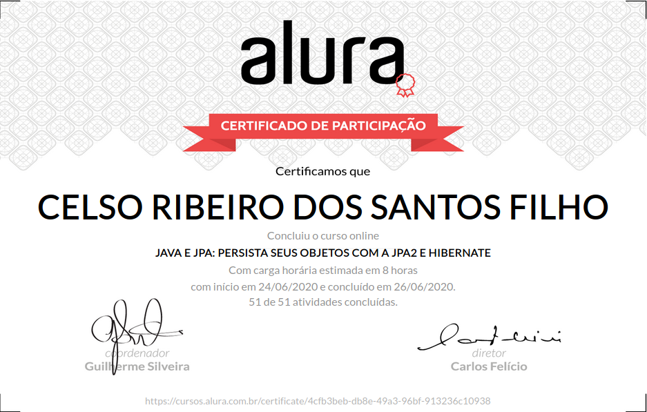

# Formação Java - Alura
+ Programe sistemas Web com Spring MVC, JPA e Java

# Curso 14 - Java e JPA: Otimizações com JPA2 e Hibernate

## O que estou aprendendo neste curso:

+ Entenda as dificuldades do uso do JDBC puro.

+ Melhore o desempenho com Cache.

+ Escreve consultas dinâmicas com Criteria.

+ Gerencie as conexões com Pool e DataSource.

+ Use corretamente o padrão EntityManagerInView.

+ Evite conflitos com Locks.

## Conteúdo das Aulas

+ Mapeando relacionamentos Muitos-para-Muitos
                
        Pré-requisitos do treinamento
        O projeto do curso
        Primeiras considerações
        (Obrigatório) Preparando o ambiente
        Mapeando relacionamentos Muitos-para-Muitos
        Anotação de relacionamento
        Um é bom, dois é demais!
        Para saber mais: Alterando o nome da tabela de relacionamento

+ Consultas dinâmicas com Criteria API 
  
        Consultas dinâmicas com Criteria API
        Montando as consultas dinâmicas
        Para saber mais: O método toArray
        Fabricar ou construir?
        Usando vários Predicates
        Matando o problema pela raiz!
        Para saber mais: Conhecendo a Criteria API do Hibernate

+ O comportamento Lazy e OpenEntityManagerInView 
      
        O comportamento Lazy e OpenEntityManagerInView
        Configurando OpenEntityManagerInView com Spring
        O que causa a LazyInitializationException?
        Planejando criteriosamente nossas queries
        O problema do N + 1
        Sobre o padrão OpenEntityManagerInView
        Para saber mais: Grafos de relacionamento com EntityGraphs
        Para saber mais: Atualizando somente o que preciso com @DynamicUpdate
   
+ Gerenciando conexões com Pool de conexão
        
        Gerenciando conexões com Pool de conexão
        Escalando montanhas ou sistemas?
        Configurações importantes do Pool C3P0
        Configurando as conexões
        Lidando com conexões quebradas
        Para saber mais: E se eu não usar Spring? 
        
+ Evitando conflitos com Lock otimista 

        Quem chegará primeiro?
        Evitando conflitos com Lock otimista
        Onde está o Lock Pessimista?
        Brincando com o Lock Pessimista
        Por que Lock Otimista?

+ Melhorando o desempenho com Cache

        Melhorando o desempenho com Cache
        Utilidade do Cache
        Conhecendo o cache de primeiro nível
        Cache de primeiro nível
        Conhecendo o cache de segundo nível
        Habilitando cache de segundo nível
        Invalidando dados
        Configurando o provider
        Indicando o que colocar no cache
        Cache de queries
        Opções de estratégia
        Para saber mais: Fine-tuning do Cache de segundo nível

+ Caçando seus gargalos com o Hibernate Statistics 

        Caçando seus gargalos com o Hibernate Statistics
        Deixando Statistics Acessível
        Mais estatísticas
        Mãos na massa
        Projeto do curso

# Certificado de conclusão

<!--  -->