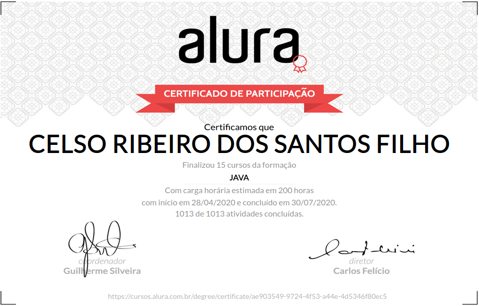

# Formação Java: Alura cursos online 
Programe sistemas Web com Spring MVC, JPA e Java.

Java é a linguagem de programação mais usada no mundo, segundo o famoso ranking da TIOBE. Por ser multiplataforma e bastante completa, a plataforma Java ganhou muitos mercados diferentes - da Web ao Desktop, passando por mobile e IoT. Mas o grande mercado Java hoje ainda é o back-end em sistemas Web.

## O que estou aprendendo nesta formação

A Formação Java da Alura é um guia de aprendizado completo para você iniciar uma carreira bem sucedida como programador Web Java. Você vai aprender desde os fundamentos da linguagem junto com as boas práticas e o essencial conhecimento de uma boa modelagem orientada a objetos.

Em seguida, você aprenderá a navegar a vasta sopa de letrinhas de frameworks, ferramentas e tecnologias diferentes disponíveis. Na Formação, serão apresentadas as principais. O Maven, para fazer build dos projetos. A JPA como principal solução para acesso a bancos de dados do mercado Java. E o Spring, o framework mais usado atualmente no mercado.

Ao final da Formação, você estará pronto para os desafios de projetos reais no dia a dia de uma empresa que use Java na Web.

# Roteiro de Estudos

## 1 Java e Orientação a Objetos

O primeiro passo é entender bem a linguagem Java, base de tudo que faremos nessa formação. E, para isso, é essencial desenvolver um conhecimento sólido em orientação a objetos e boas práticas de código.

+ [Java parte 1: Primeiros passos](fundamentos)

+ [Java parte 2: Introdução à Orientação a Objetos](introducao-orientacao-objetos)

+ [Java parte 3: Entendendo herança e interface](entendendo-heranca-interface)

+ [Java parte 4: Entendendo exceções](entendendo-excecoes)

## 2 Bibliotecas Java 

Uma das grandes vantagens do Java é sua extensa biblioteca padrão multiplataforma. É essencial conhecer seus principais pacotes, como java.lang, I/O e coleções.

+ [Java parte 5: Pacotes e java.lang](pacotes-java-lang)

+ [Java parte 6: Conhecendo o java.util](conhecendo-java-util)

+ [Java parte 7: Trabalhando com java.io](trabalhando-java-io)

+ [Java: Dominando as Collections](dominando-collections)

+ [Java Reflection: Entendendo a metaprogramação](java-reflection-parte01)

## Servlets e Maven

Com uma boa base de Java, é hora de entrar na Web e em suas principais tecnologias. As servlets e o JSP são a base de toda estrutura do Java na Web. E o Maven é a principal ferramenta de build em projetos Java. Você certamente vai se deparar com tudo isso no dia a dia.

+ [Maven: Build do zero a web](maven)

+ [Servlet Parte 1: Fundamentos da programação web Java](servlet-parte01)

+ [Servlet parte 2: Autenticação, autorização e o padrão MVC](servlet-parte02)

## Banco de dados

Praticamente nenhuma aplicação existe sem bancos de dados. É importante saber como acessá-los com Java. E a JPA é a principal tecnologia para isso, trabalhando um um mapeamento do seu modelo Java com as tabelas do banco.

+ [Java e JDBC: Trabalhando com um banco de dados](JDBC)

+ [Java e JPA: Persista seus objetos com a JPA2 e Hibernate](JPA2-parte01)

+ [Java e JPA: Otimizações com JPA2 e Hibernate](JPA2-parte02)

## Spring MVC

Existem muitos frameworks Web no mundo Java, mas o Spring é onipresente. É uma opção bastante completa e robusta e possui imenso apelo no mercado. Sua carreira Web em Java só estará completa depois que conhecer o Spring.

+ [Spring MVC I: Criando aplicações web](Spring-MVC-parte01)

+ [Spring MVC II: Integração, cache, segurança e templates](Spring-MVC-parte02)

# Certificado de conclusão da formação em Java

https://cursos.alura.com.br/degree/certificate/ae903549-9724-4f53-a44e-4d5346f80ec5

