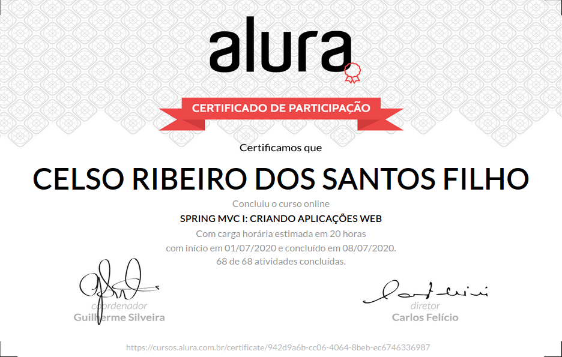

# Formação Java - Alura
+ Programe sistemas Web com Spring MVC, JPA e Java

# Curso 15 - Spring MVC: Criando aplicações web

## O que estou aprendendo neste curso:

+ Conheça a fundo o SpringMVC.

+ Use o HTTP com seus métodos e estados.

+ Valide seus formulários de maneira fácil.

+ Trabalhe com upload de arquivos.

+ Use as URL's da aplicação a seu favor.

+ Use o modelo de integração REST.

## Conteúdo das Aulas

+ Começando com SpringMVC
                
        Introdução
        Didática do curso
        Criação do projeto
        Avaliando o projeto gerado pelo JBoss Forge
        O primeiro Controller
        Completando Controller

+ Cadastro de produtos 
  
        Preparando ProdutosController
        Preparando Spring com JPA
        Sobre a utilização do @AutoWired
        Configurando o TransactionManager

+ Cadastro de preços do produto  
      
        Modelando o tipo e preço
        Utilização do ModelAndView
        Testando o cadastro
   
+ Listando os produtos 
        
        Preparando Controller, DAO e JSP
        Encoding e ajustes no Controller
        Utilização de métodos de requisição do HTTP
        
+ Redirect com Escopo de Flash  

        Redirect com Escopo de Flash
        Escopo de Flash
        Always Redirect After Post

+ Validação e conversão de dados

        Validação e conversão de dados
        Erro com a JRE 9 +
        Validator do Spring MVC

+ Mais Validações  

        Preparando ResourceBundle
        Ajustando o HTML

+ Trabalhar com datas 

        Trabalhando com data
        Melhorando as configurações

+ Enviando arquivos ao servidor

        Configurando Multipart
        Salvando upload

+ URLs amigáveis

        Arquivos extras
        URLs amigáveis

+ Expondo atributos no JSP

        Expondo atributos
        Mãos na massa: Expondo atributos na JSP

+ Escopo sessão 

        Escopo Sessão
        Entendendo o escopo
        Tipos de escopo

+ Carrinho de compras

        Arquivos extras
        Listando os itens
        Finalizando o código

+ Finalizando o carrinho

        Finalizando o carrinho
        Usando RestTemplate
        Requisições assíncronas
        Mãos na massa: Finalizando o carrinho
        Projeto completo

# Certificado de conclusão

<!---  -->