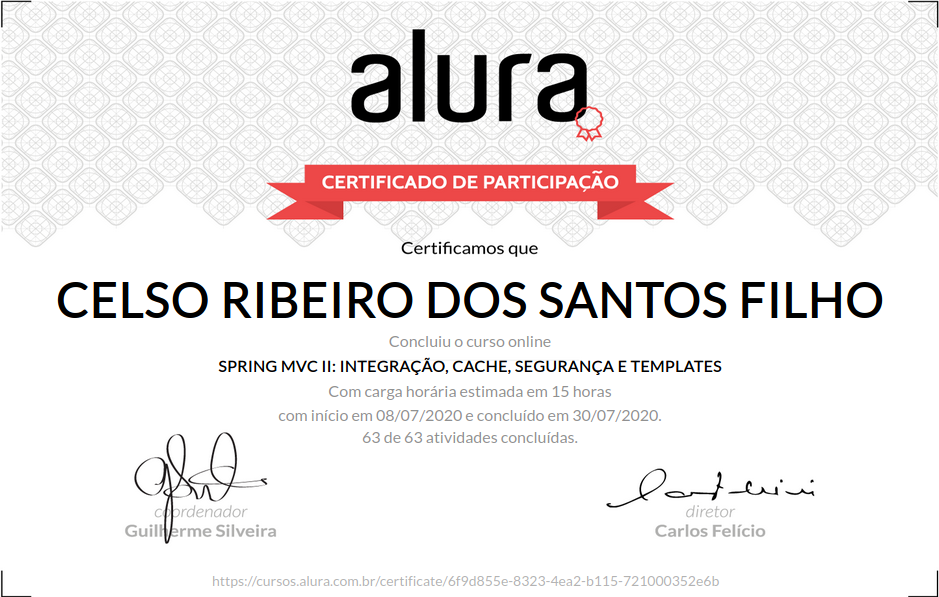

# Formação Java - Alura
+ Programe sistemas Web com Spring MVC, JPA e Java

# Curso 16 - Spring MVC: Integração, cache, segurança e templates

## O que estou aprendendo neste curso:

+ Utilize cache para acelerar o desempenho de seu site.

+ Integre serviços com REST.

+ Use o Bootstrap para o design.

+ Proteja sua aplicação com Spring Security.

+ Padronize a loja com templates.

## Conteúdo das Aulas

+ Desempenho com Cache
                
        Projeto inicial
        Arquivos extras
        Ajustando a home
        Habilitando o cache
        Invalidando o cache
        Usando Guava

+ Criação do Serviço Rest 
  
        Trabalhando com JSON
        ContentNegotiation

+ Usando o Bootstrap  
      
        Importando Bootstrap
        Aplicando classes
   
+ Spring Security 
        
        Habilitando Spring Security
        Autorizando acesso
        Criando Usuario e UsuarioDAO
        Taglibs do Spring Security
        Evitando ataques do tipo CSRF
        Personalizando Login e Logout
        
+ Views com Template  

        Separando cabeçalho e rodapé
        Usando o include
        Vantagem e desvantagem do include
        Tag de Template
        JSP Fragment

+ i18n

        Usando a taglib fmt
        Internacionalização
        Mudando locale dinamicamente

+ Testando a aplicação  

        Preparando o teste
        Feedback pelo teste
        Trabalhando com profiles
        Profile da aplicação
        Testando Controllers
        Testando Permissões
        Testando as nossas classes

+ Ajustes finais no projeto

        Enviando email
        Envio de e-mails
        Usando JavaMail
        Usando Gmail para enviar e-mails
        Open EntityManager In View
        LazyInitializationException
        Causas do LazyInitializationException
        Formas de usar o Lazy Initialization
        Tratamento de exceções
        Tratando erros gerais

+ Publicando o projeto

      Deploy no Heroku
        Heroku Toolbelt
        Usuário no Postgres
        Mãos na massa: Publicando o projeto
        Projeto do curso

# Certificado de conclusão

<!-- -  -->