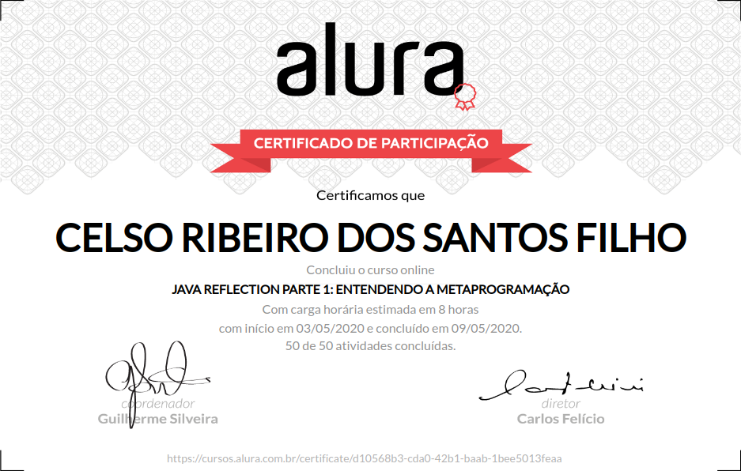

# Java Reflection parte 1: Entendendo a metaprogramação

+ Tecnologia usadas por bibliotecas como Hibernate, Spring e CDI.

+ Entendendo como a linguagem e seu programa funciona em tempo de execução.

+ Escrevendo código usando Class, Constructor, Method, Field e afins.

+ Aprendendo como criar a própria biblioteca código.

+ Deixando o código mais dinâmico com a metaprogramação e reflection.

## Aulas

### Começando com Reflection 

    Introdução
    Sobre metaprogramação
    Visão geral do problema
    Projetos do curso
    Criação de objetos
    Descrição dos projetos
    A classe Class
    Criação de objetos na prática
    Instanciar objeto de Class
    Consolidando seus conhecimentos
    O que aprendemos?

### Criação de objetos com Constructor

    Criando objetos corretamente
    A classe Constructor
    Instâncias de Constructor
    A vantagem do Constructor.newInstance()
    A vantagem do newInstance() de Constructor
    Criação de objetos na prática
    Consolidando conhecimentos
    O que aprendemos?

### Executando métodos e boas práticas

    Mantendo a legibilidade do código
    Invocação de métodos sem parâmetros
    Como recuperar um método?
    Instâncias de Method
    Invocando método
    Invocação de métodos sem parâmetros na prática
    Consolidando conhecimentos
    O que aprendemos?

### Executando métodos com parâmetros

    Invocação de métodos com parâmetros
    Sobre manipulação de métodos
    Invocação de métodos com parâmetros na prática
    Filtrando métodos
    Finalizando a invocação de métodos com parâmetros
    Selecionando um método
    A classe Parameter
    Consolidando conhecimentos
    O que aprendemos?

### Lidando com exceções

    Lidando com exceções e boas práticas
    (DESAFIO) Tratamento especial para InvocationTargetException
    Exceção ao executar método
    O código está correto?
    Sobre a IllegalArgumentException
    Conclusão
    Consolidando conhecimentos
    O que aprendemos?
    Pronto para continuar?

# Certificado de conclusão

https://cursos.alura.com.br/certificate/d10568b3-cda0-42b1-baab-1bee5013feaa

