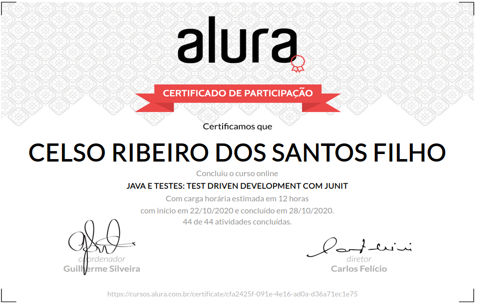

# Java e Testes: Test Driven Development com Junit

+ TDD: vantagens e desvantagens.

+ Automatize o seu teste de unidade.

+ Como funciona o ciclo do TDD.

+ Use o @setUp para preparar o cenário de teste.

+ Faça testes com DataBuilders.

+ Testando exceptions.

## Aulas

### Começando com testes de unidade 
    
    Começando com testes de unidade
    Meu primeiro teste de unidade
    Ordem dos parâmetros do Assert
    Pasta que guardamos o teste
    Import do JUnit
    Delta no assert com doubles
    Média dos Lances
    Vantagens do teste de unidade
    Produtividade e testes automatizados

### Testando o que realmente é necessário 
    
    Testando o que realmente é necessário
    Teste de um único lance no Avaliador
    Teste de lances em ordem aleatória
    Teste em ordem decrescente do Avaliador
    Testando listas
    Casos que precisam de atenção no teste
    Três maiores lances
    Perceber erros sem testes de unidade
    Quantidade de testes
    Testando a classe MatematicaMaluca
    Desafio: testes do filtro
    Dificuldades nos testes de unidade

### Praticando Test-Driven Development (TDD)

    Praticando Test-Driven Development (TDD)
    Praticando TDD
    Baby steps
    Baby steps ao extremo
    Testar código simples?
    Devemos ver o teste falhar?
    Dobrando o lance anterior
    TDD 100% do tempo
    Desafio: Ano Bissexto
    O que é TDD?

### Cuidando dos seus testes 
    
    Cuidando dos seus testes
    Usando o @Before no AvaliadorTest
    Entendendo o @Before
    Conhecendo o @After
    Test Data Builder
    @BeforeClass e @AfterClass
    Vantagens de testes de qualidade

### Testando exceções
    
    Testando exceções
    Testando exceções
    Mais exceções
    Começando com Hamcrest
    Opinião do Hamcrest
    Desafio: Criando um novo matcher

# Certificado de conclusão

https://cursos.alura.com.br/certificate/cfa2425f-091e-4e16-ad0a-d36a71ec1e75

