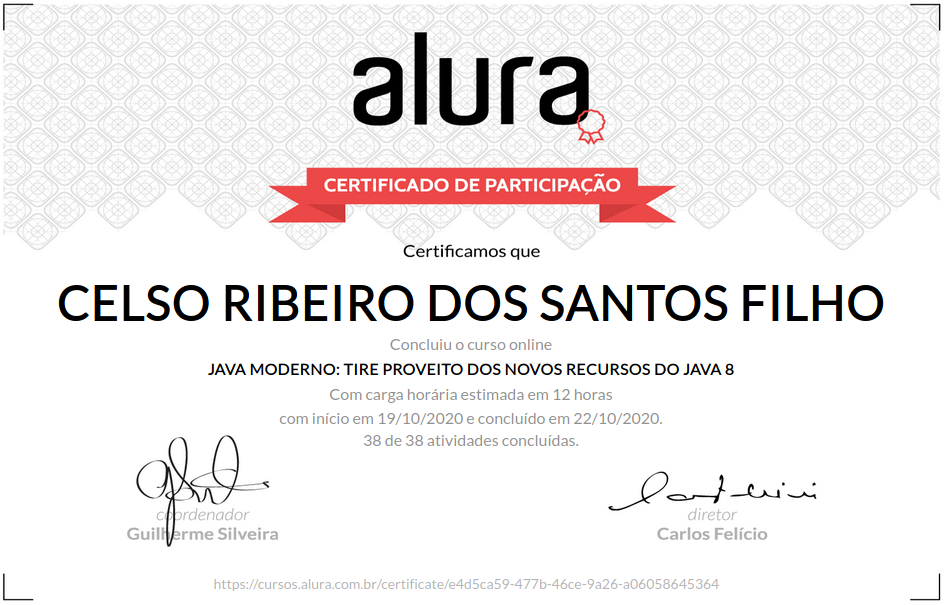

# Java moderno: Tire proveito dos novos recursos do Java 8

+ Entenda o que muda com o Java 8.

+ Aprenda a percorrer uma collection com o forEach.

+ Diminua a quantidade de linhas de seu código usando o Lambda.

+ Faça filtos e mapeamentos em Collections usando o Stream.

+ Trabalhe com a nova API de Datas.

+ Dê seus primeiros passos na programação funcional.

## Aulas

### Default Methods 
    
    Default Methods
    Parâmetro do método forEach
    Novo default method forEach
    Ordenando com o método sort
    Quais são os novos métodos default em List?
    Vantagens dos default methods

### Que venham os lambdas!

    Que venham os lambdas!
    Métodos de uma interface funcional
    Escrevendo o forEach com lambda
    Método sort com lambda
    Entendendo o tipo de um lambda
    Threads com lambda!

### Código mais sucinto com Method references

    Código mais sucinto com Method references
    De lambda para method reference
    Conhecendo o Comparator.comparing()
    Escrevendo o comparing com method reference
    Usando importe estático
    Mudando o critério de comparação
    Tirando proveito de method reference no forEach

### Streams: trabalhando melhor com coleções 
    
    Streams: trabalhando melhor com coleções
    Filtro de cursos com Stream
    Filtrando cursos com mais de 50 alunos
    Utilizando o método map
    Tirando mais proveito do method reference
    Mais sobre a API de Stream

### Mais Streams, Collectors e APIs 
    
    Mais Streams, Collectors e APIs
    Retornar qualquer elemento de um Stream
    Versão de Stream para um double
    Retornando o primeiro elemento do Stream
    Trabalhando com Optional
    Calculando média de quantidade de alunos
    Coletando o resultado do stream em uma List

### A nova API de datas    

    A nova API de datas
    Data e hora com time-zone
    Data atual com LocalDate
    Criando uma data com LocalDate
    Criando um período entre duas datas
    Formatando suas datas

# Certificado de conclusão

<!-- https://cursos.alura.com.br/certificate/d10568b3-cda0-42b1-baab-1bee5013feaa

 -->
