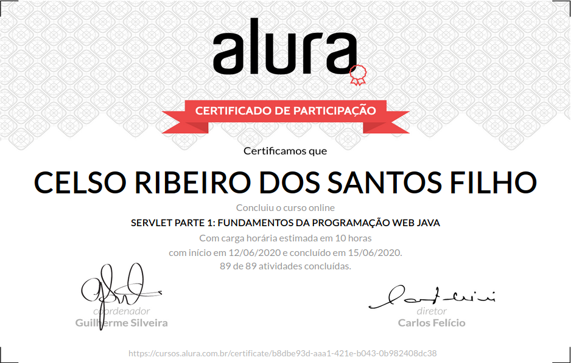

# Formação Java - Alura
+ Programe sistemas Web com Spring MVC, JPA e Java

# Curso 10 - Servlet Parte 1: Fundamentos da programação web Java

## O que estou aprendendo neste curso:

+ Entenda o que é um Servlet.

+ Mapeie requisições HTTP e trabalhe com POST e GET.

+ Gere HTML dinamicamente com JSP e JSTL.

+ Crie um CRUD completo e faça o deploy com Tomcat.

+ Saiba o que é inversão de controle.

## Conteúdo das Aulas

+ Fundamentos da Web e a API de Servlets

        Introdução ao curso
        Criando Ambiente
        Sobre o Tomcat
        Apache HTTP ou Apache Tomcat?
        Primeiro projeto Java Web
        Problemas no acesso
        Finalmente, o primeiro servlet
        Como acessar?
        Sobre Servlet

+ Trabalhando com POST e GET
  
        Enviando parâmetros
        Parâmetros da requisição
        Metodos GET e POST
        Formulário HTML
        Diferença entre GET e POST
        Apenas POST
        O método doPost
        Sobre o método service
        Para saber mais: O protocolo HTTP

+ Definindo o nosso modelo 
        
        Definido modelo
        Instância de HttpServletRequest
        Qual método?
        Listando empresas com servlets
        Sobre modelagem
        
+ Páginas dinâmicas com JSP

        Primeiro JSP
        Sobre JSP
        Sobre Scriptlet
        Mais sobre Scriptlet
        Despachando a requisição
        RequestDispatcher
        JSP para listar empresas
        
+ JSTL e Expression Language

        Conhecendo Expression Language
        Expression Language
        Download do JSTL
        Conhecendo JSTL
        Sobre o JSTL
        Resultado com forEach
        Usando a taglib core
        Mais forEach
        Usando a taglib fmt
        Para saber mais: Cuidado ao importar
        Para saber mais: Mais JSTL?

+ Redirecionando o fluxo

        Quando o dispatcher não atende
        Sobre o RequestDispatcher
        Código de resposta HTTP
        Redirecionamento pelo navegador
        O Botão F5
        Desafio: Código para redirecionamento
        Qual redirecionamento?
        Para saber mais: Chrome DevTools

+ Completando o CRUD

        Apresentando as funcionalidades
        O que é CRUD?
        Removendo empresa
        Maneira correta de identificação
        Formulário de alteração
        Alterando empresa
        Achando o problema

+ Deploy da aplicação

        Conhecendo o web.xml
        Sobre o mapeamento
        Para saber mais: Uma servlet, várias URLs
        Inversão de controle
        Inversão de que?!
        Fixando o funcionamento
        Para saber mais: Tomcat sem preguiça
        Deploy da aplicação
        Entendendo mais sobre deploy

# Certificado de conclusão

https://cursos.alura.com.br/certificate/b8dbe93d-aaa1-421e-b043-0b982408dc38

