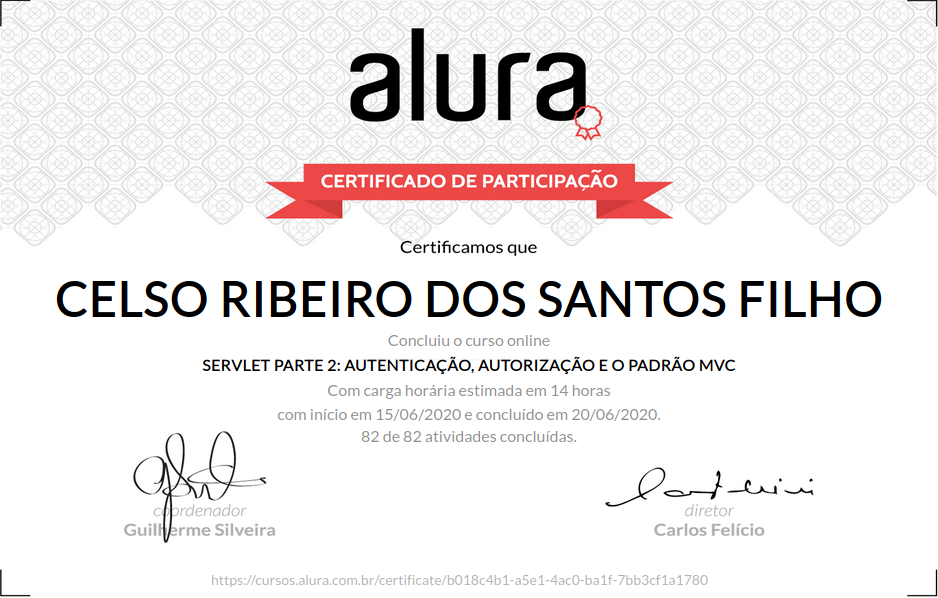

# Formação Java - Alura
+ Programe sistemas Web com Spring MVC, JPA e Java

# Curso 11 - Servlet parte 2: Autenticação, autorização e o padrão MVC

## O que estou aprendendo neste curso:

+ Desenvolver um sistema com autenticação e autorização.

+ Usar o objeto HttpSession e aprender sobre Cookies.

+ Construir as camadas MVC baseados em Filters e Servlets.

+ Fazer deploy no servidor Jetty e Tomcat.

+ Implementar WebService com JSON e XML.

## Conteúdo das Aulas

+ Criando o controlador
                
        Introdução
        Projeto inicial
        Ambiente e projeto Inicial
        Uma única servlet
        O que é servlet?
        Implementando o controlador
        Função do controlador
        Separando ações
        Qual camada?
        Resumo
        Para saber mais: Outro mapeamento

+ O padrão MVC
  
        Centralizando o redirecionamento
        Refatorando todas as acoes
        Escondendo JSP
        O diretório WEB-INF
        Esconder JSPs?
        Melhorando o controlador
        Qual é o erro?
        Para saber mais: API de Reflexão
        Resumo sobre o padrão MVC
        Sobre o MVC
        Para saber mais: Design Pattern Command

+ Formulário de login  
      
        Preparando modelo e view
        Verificando o login
        O que mudou?
        Login funciona?
        Autenticação e autorização
        Para saber mais: O padrão JAAS
   
+ HttpSession 
        
        Trabalhando com sessão
        Detectando o problema
        A solução dos nossos problemas
        Testando o login
        Autorizando o acesso
        Implementando o logout
        Sabendo as diferenças
        Para saber mais: Timeout da sessão
        
+ Aplicando filtros

        Primeiro filtro
        Filter x Servlet
        Filtro de autorização
        Ordem de execução
        Anotações x web.xml
        Onde está o problema?
        Para saber mais: Interceptor ou Filter

+ Introdução ao Web Services

        O que é um Web Service?
        Download das bibliotecas JSON e XML
        Serviço com JSON
        Retornar HTML?
        Serviço com XML
        Para saber mais: Autenticação
        Download do projeto do cliente
        Cliente do serviço
        Bibliotecas
        Para saber mais: O que é API?
        
+ Deploy da aplicação 

        Preparando o ambiente
        Servlet Container Jetty
        Observando as diferenças
        Especificação das Servlets
        Funcionamento de um Servlet Container
        Para saber mais: Servlet x HttpServlet
        Projeto completo
        O que aprendemos?
        Conclusão

# Certificado de conclusão

https://cursos.alura.com.br/certificate/b018c4b1-a5e1-4ac0-ba1f-7bb3cf1a1780

