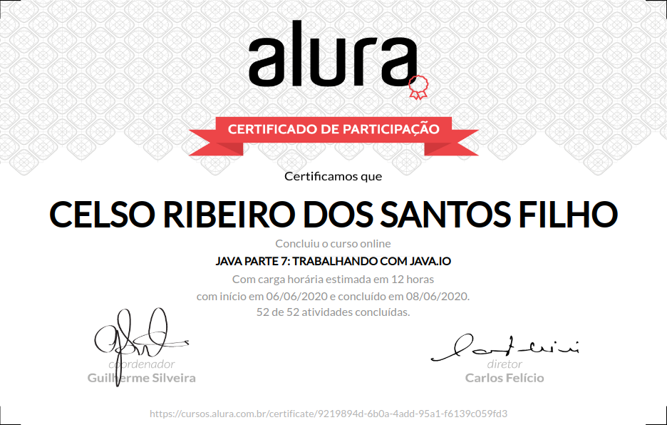

# Formação Java - Alura
+ Programe sistemas Web com Spring MVC, JPA e Java

# Curso 07 - Trabalhando com java.io

## O que estou aprendendo neste curso:

+ Aprenda os fundamentos sobre java.io.

+ Estabeleça entradas e saídas de fluxos diferentes.

+ Saiba a diferença entre fluxos binários e fluxos de caracteres.

+ Use a serialização Java e classe como Scanner, PrintStream ou Properties.

+ Entenda charsets e os problemas no encoding de caracteres.

## Conteúdo das Aulas

+ Leitura com java.io

        Introdução
        Estabelecendo a entrada
        Abertura de arquivos
        InputStream e Reader
        Leitura de linhas
        Leitura de arquivos
        Mãos na massa: Leitura de arquivo

+ Escrita com java.io 
        
        OutputStream e Writer
        Escrita de forma binária
        Outras entradas e saídas
        Flexibilidade no I/O
        Escrevendo no console
        Resumo
        Mãos na massa: Escrita em um arquivo
       
+ FileWriter e PrintStream
 
        Saída com FileWriter
        Sobre o FileWriter
        PrintWriter e PrintStream
        Saída para arquivo de texto
        Escrita independente do sistema
        Mãos na massa: Leitura e escrita mais simples
        Para saber mais: currentTimeMillis

+ Usando java.util.Scanner 
        
        Leitura com Scanner
        Lendo arquivos com Scanner
        Parseando arquivo
        Separando o conteúdo
        Formatação de valores
        Formatação expressiva
        Mãos na massa: Scanner
        Para saber mais: java.util.Properties

+ Encoding e Charsets

        Character Sets
        Certo ou Errado?
        Para saber mais: FAQ do UNICODE
        Encoding no Windows
        Encoding no Java
        Encoding com java.io
        UTF-8 no arquivo
        Mãos na massa: Encoding e Charsets

+ Serialização de objetos

        Serialização Java
        Fluxo binário
        Serializando qualquer objeto
        Sobre serialVersionUID
        Serializando com herança
        Serializando composições
        Sobre a Serialização
        Mãos na massa: Serialização e desserialização de objetos
        Conclusão

# Certificado de conclusão

https://cursos.alura.com.br/certificate/9219894d-6b0a-4add-95a1-f6139c059fd3

